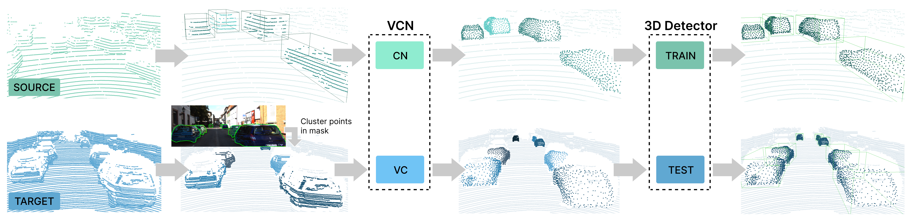

# SEE-VCN

This is the official codebase for 

Viewer-Centred Surface Completion for Unsupervised Domain Adaptation in 3D Object Detection

### Abstract

Every autonomous driving dataset has a different configuration of sensors, originating from distinct geographic regions and covering various scenarios. As a result, 3D detectors tend to overfit the datasets they are trained on. This causes a drastic decrease in accuracy when the detectors are trained on one dataset and tested on another. We observe that lidar scan pattern differences form a large component of this reduction in performance. We address this in our approach, SEE-VCN, by designing a novel viewer-centred surface completion network (VCN) to complete the surfaces of objects of interest within an unsupervised domain adaptation framework, SEE. With SEE-VCN, we obtain a unified representation of objects across datasets, allowing the network to focus on learning geometry, rather than overfitting on scan patterns. By adopting a domain- invariant representation, SEE-VCN can be classed as a multi-target domain adaptation approach where no annotations or re-training is required to obtain 3D detections for new scan patterns. Through extensive experiments, we show that our approach outperforms previous domain adaptation methods in multiple domain adaptation settings.



We also provide a separate standalone repository for [VCN](https://github.com/darrenjkt/VCN) if you'd like to experiment. 

## Installation
We recommend running this repository with our provided docker image. Simply modify the `docker/run.sh` file with your code and dataset paths then run the following:
```
# Start docker container
bash docker/run.sh
docker exec -it ${CONTAINER_NAME} /bin/bash

# Start docker container
bash docker/run.sh

# Install VCN
cd see/surface_completion && pip install -e . --user

# Install OpenPCDet v0.5.0
cd detector3d && python setup.py develop
```
## Demo
We provide a [demo](https://github.com/darrenjkt/SEE-VCN/blob/main/demo/demo.ipynb) jupyter notebook with demo data. You can place your own dataset into the existing folder structure to visualize the completed point clouds and predicted detection results.

For the custom dataset, we require time-synced image-point cloud pairs, and a calibration json file for each image-point cloud pair. The calibration file should have the camera instrinsic matrix, extrinsic matrix from lidar to camera, and distortion coefficients. 

## Dataset Preparation
Please refer to [DATASET_PREPARATION](https://github.com/darrenjkt/SEE-VCN/blob/main/docs/DATASET_PREPARATION.md) for instructions on downloading and preparing datasets. 

## Usage
Please refer to [TRAINING_AND_TESTING](https://github.com/darrenjkt/SEE-VCN/blob/main/docs/TRAINING_AND_TESTING.md) for instructions on training and testing with SEE-VCN.

# Acknowledgement
This project builds upon the progress of other outstanding codebases in the computer vision community. We acknowledge the works of the following codebases in our project: 
- Our instance segmentation code uses [mmdetection](https://github.com/open-mmlab/mmdetection).
- Our detector code is based on [OpenPCDet v0.3.0](https://github.com/open-mmlab/OpenPCDet/tree/v0.3.0) with DA configurations adopted from [ST3D](https://github.com/CVMI-Lab/ST3D). 

